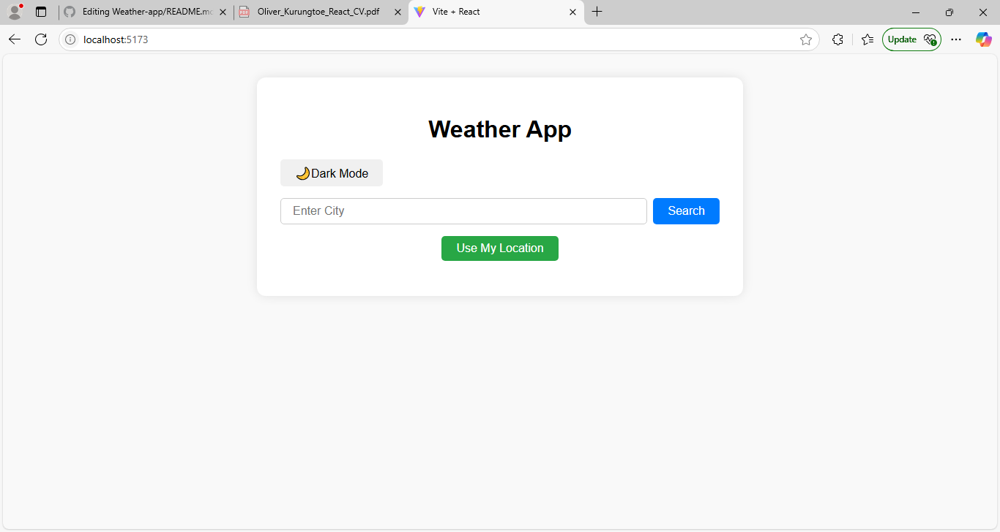
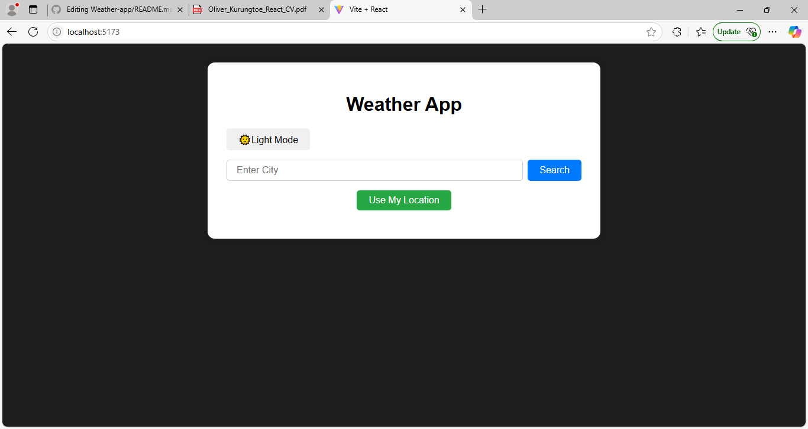

# 🌦️ Weather App

A simple and responsive weather application built with **React.js**. It fetches real-time weather data using [WeatherAPI](https://www.weatherapi.com/) and allows users to view weather information by city name or current location. Includes dark and light mode themes.

---

## 📸 Screenshots

### 🌞 Light Mode


### 🌙 Dark Mode


---

## 🚀 Features

- 🌍 Search for weather by city name
- 📍 Detect current location and show weather
- 🌡️ Shows temperature in °C and °F
- 💧 Displays humidity, wind speed, and feels-like temperature
- 🌓 Toggle between light and dark modes
- ⚠️ Loading and error handling
- 📱 Mobile responsive design

---

## 🛠️ Tech Stack

- **React.js**
- **CSS**
- **JavaScript (ES6)**
- **WeatherAPI**

---

## 📦 Installation

Clone the repo and install dependencies:

```bash
git clone https://github.com/Oliverko-coding/Weather-app.git
cd Weather-app
npm install
npm start


🌍 Geolocation Notes
When you click “Use My Location,” your browser may ask for permission.

If you deny it, the app won’t be able to fetch your local weather.

🧠 Author
Oliver Naansok Kurungtoe
📧 kurungtoeo@gmail.com
📱 +2349135472217
🎓 Computer Science, University of Jos
📌 GitHub Profile

📄 License
This project is open-source and free to use.

